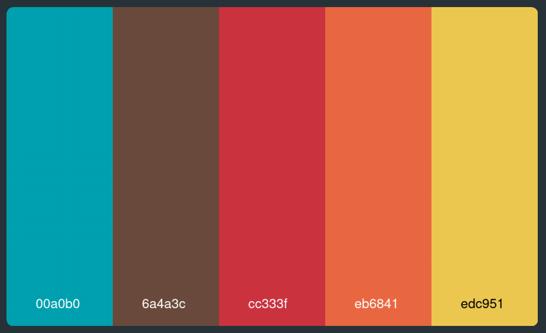
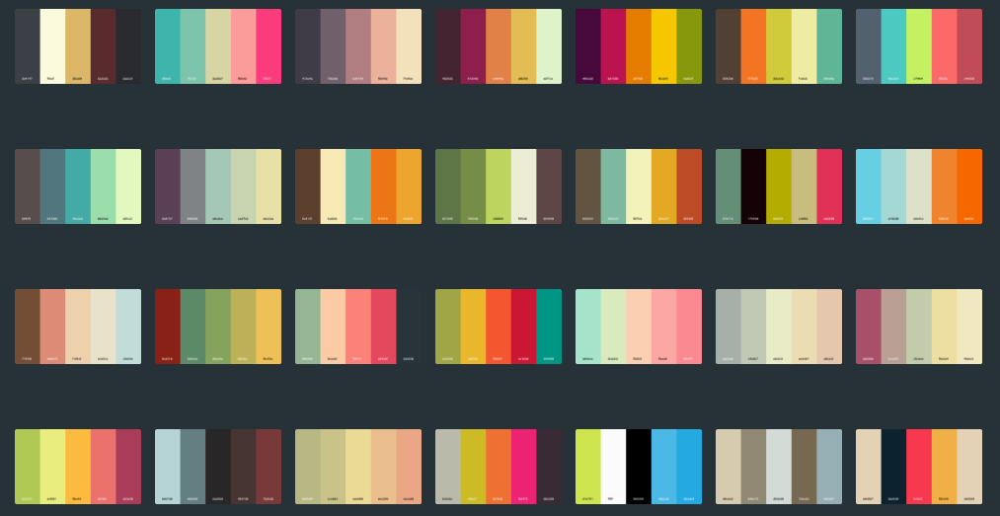

# Generate Color Palettes

A shell script that generates color palettes in PNG format based on JSON file input.

# Instructions

1. `git clone https://github.com/majamin/color-palette-generator`
1. `cd color-palette-generator`
1. `chmod +x colors.sh`
1. `./colors.sh`

# What it does

1. `colors.sh` downloads 1000.json from my [repo](https://github.com/majamin/nice-color-palettes) (original: https://github.com/Jam3/nice-color-palettes).
1. Converts the JSON file to a simple plain text file of one palette per line.
1. Calculates whether a black or white font color should be used depending on color.
1. Uses ImageMagick to convert each color to a rectangle and combines.
1. Uses ImageMagick to create a nice "rounded rectangle" image mask.
1. Writes output to a separate directory.

# Preview

One:

Many:

# Issues

PRs are welcome.
