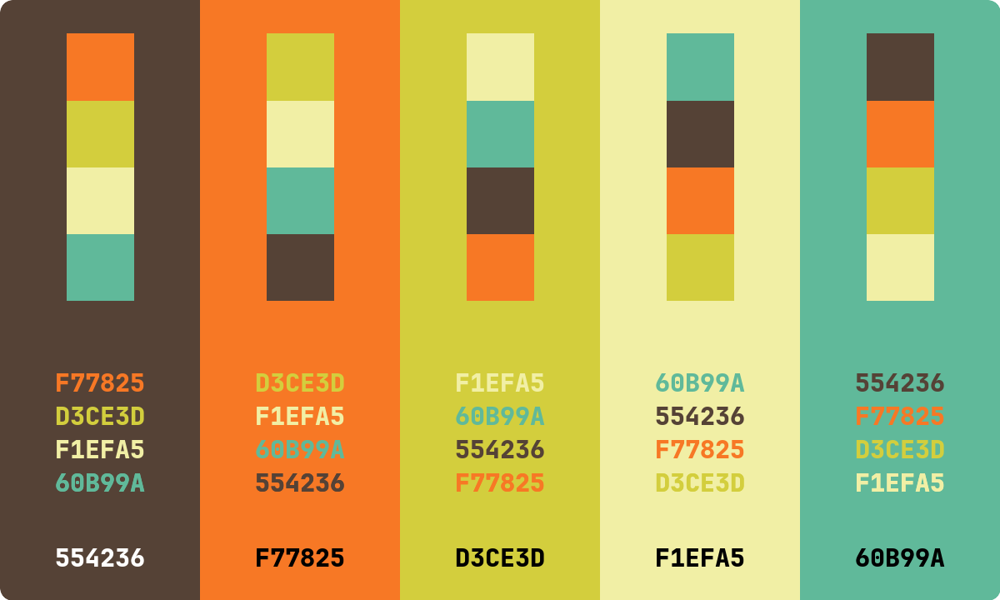
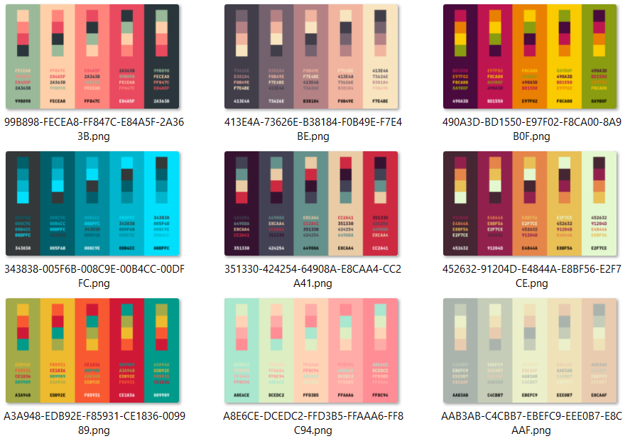

# Generate Color Palettes

A shell script that generates color palettes in PNG format. This script does
not generate the palettes themselves - it only aids in visualizing
predetermined colorschemes by input from a file (see colors.txt) or from stdin.

An example of how to get colors in the appropriate format is given in the script.

[This](https://github.com/Jam3/nice-color-palettes) is original repo that inspired this script.

## Instructions

You'll need `cat` (present on most systems), `ImageMagick`, and `bc`.
Optionally, `curl` and `jq` to retrieve the original color schemes.

1. `git clone https://github.com/majamin/color-palette-generator`
1. `cd color-palette-generator`
1. `chmod +x colors.sh`
1. `./colors.sh colors.txt`

## What it does

1. Uses ImageMagick to convert each color to a rectangle and combines.
1. Uses ImageMagick to create a nice "rounded rectangle" image mask.
1. Adds black or white HEX text to each color on bottom row.
1. Adds each permutation to HEX text to each color on middle row.
1. Adds color swatch of each color to top row.
1. Writes output to a separate directory.

## Preview

One:

Many:

## Issues

PRs are welcome.

## Updates

(2024-10-13)

- adding rows of swatches and text for easier comparison
- handle file input, add messages.
- added jetbrainsmono for convenience.
- fixed _imagemagick_ dependency for the actual binary (magick)
- replaced _convert_ with _magick_
- removed invalid colors from colors.txt
- consistent variable case in colors.sh
